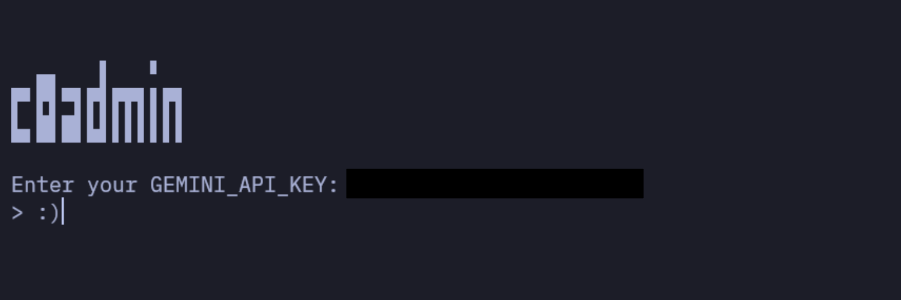

# c0admin

Suggests GNU/Linux terminal commands from natural language using AI, with an AI-assisted sysadmin toolkit.



> [!WARNING]
> For the automatic copy to clipboard feature to work, you must have the ‘xsel’ and ‘xclip’ packages installed on your system.

[How to get personal Google Gemini API key?](https://github.com/ufuayk/c0admin/blob/main/docs/how-to-get-gemini-api-key.md)

## Installation

To install `c0admin` system-wide with the universal installer:

```bash
curl -s https://raw.githubusercontent.com/ufuayk/c0admin/main/scripts/install.sh -o install.sh && bash install.sh
```

This will:

- Download and install c0admin to ~/.c0admin/
- Set up a Python virtual environment
- Install dependencies
- Make c0admin available as a global terminal command

After installation, you can start the app anytime by simply typing:

```bash
c0admin
```

## Commands

- `/help` — Display help information.
- `/del` — Delete the GEMINI API KEY.
- `/exit` — Exit the app safely.
- `/history` — Displays the command history (history.txt).
- `/clear` — Clear the current session conversation history.
- `/setinst <url>` — Set a custom system instruction from a given URL.
- `/resetinst` — Reset system instruction to the default one.
- `/theme [name|list]` — Show or set the color theme.
- `/model [main|report] <id>|list` — Show/list/switch AI model at runtime.
- `/json [on|off]` — Toggle machine-readable JSON output.
- `/debug [on|off]` — Toggle verbose debug output.
- `/health` — AI-analyzed system health report (CPU, memory, disks, network).
- `/ps top|list|kill|analyze` — Process manager with AI analysis.
- `/net ping|trace|dns|check` — Network diagnostics.
- `/run <command>` — Run a command after an AI safety check.

Up/down arrow keys recall your previous inputs, like a normal terminal.

## Models

c0admin routes different tasks to different models:

- `main_model` — the main command-suggestion chat (`gemini-3.8-flash`).
- `report_model` — lighter model for system reports and analysis (`gemini-3.5-flash-lite`).
- `model_fallbacks` — automatic fallback chain when a model is busy or unavailable.
- `thinking` — thinking level, defaults to `medium`.

Everything is configurable in `config.json`, or at runtime with `/model`. Deprecated model IDs are migrated automatically.

Current model options (September 2026):

- `gemini-3.8-flash` — newest GA Flash; engineered for long-horizon coding, agents and complex workflows (default `main_model`).
- `gemini-3.7-flash` — GA; strong coding/agentic performance with lower token usage.
- `gemini-3.6-flash` — GA; balanced speed and multimodal capability for everyday tasks.
- `gemini-3.5-flash` — GA; legacy workhorse for routine, high-throughput workloads.
- `gemini-3.5-flash-lite` — fastest, most cost-effective 3.5 model (default `report_model`).
- `gemini-3.1-flash-lite` — budget stable model for high-volume tasks.
- `gemini-3.1-pro-preview` — reasoning-first preview with a 1M token context.
- `gemini-3-flash-preview` — previous-generation Flash preview.

> [!NOTE]
> `gemini-3.8-flash` and `gemini-3.7-flash` do not accept the `minimal` thinking level; the default is `medium`. Older `minimal` configs are upgraded automatically.

## Custom System Instructions

From the [system-instructions](https://github.com/ufuayk/c0admin-system-instructions) repo you can see all the community-created system instructions.

We welcome your contributions on this issue.

## Security & Legality

`/run` asks the AI to audit a command before executing it; `DANGEROUS` commands are blocked.

## Contributing

1. Fork the repository
2. Create a feature branch (`git checkout -b feature/amazing-feature`)
3. Commit your changes (`git commit -m 'Add amazing feature'`)
4. Push to the branch (`git push origin feature/amazing-feature`)
5. Open a Pull Request

## Disclaimer

This software (c0admin) and toolkit are provided "as is" without warranty of any kind, express or implied. The code, commands, or AI-generated outputs—especially system health reports and actions executed via `/run`—may lead to system instability, data loss, or unexpected behavior.

Use this tool entirely at your own risk. The developers assume no responsibility or liability for any direct or indirect damages resulting from its use. Don't go running random commands blindly; you are completely on your own, my friend. :P